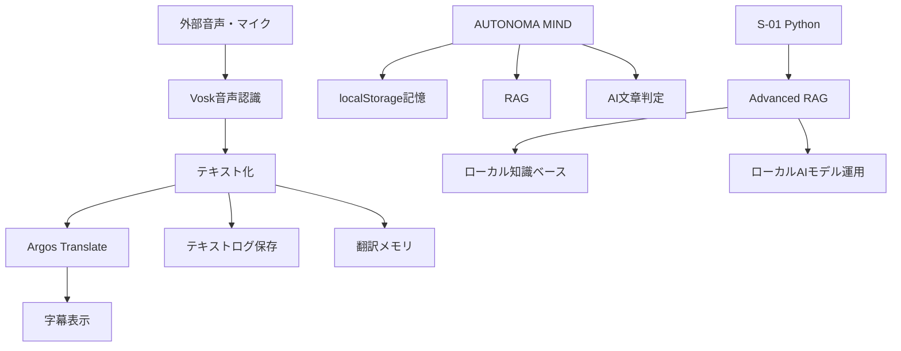

# eitaaaan / Extend World

<p align="center">
  <b>Free and easy for anyone to use.</b><br>
  音声・言語・知識・AIを、誰でも安全に使える形へ広げるプロジェクトです。
</p>

<p align="center">
  
  
  
  
  
</p>

## 概要

**Extend World** は、言語の壁を下げるための個人開発プロジェクトです。

中心テーマは、リアルタイム音声翻訳、字幕、ローカル優先のAI、知識ベース、AI判定、安全な個人データ設計です。

目標はシンプルです。

- 誰でも無料で使いやすいこと
- 音声や会話履歴などの個人情報を慎重に扱うこと
- 重すぎるCPU/GPU処理に頼らず、軽く動くこと
- LLMや有料APIを必須にしないこと
- 話している相手にすぐ返答できる字幕・翻訳体験を作ること

## 現在の主な成果物

| ファイル | 内容 |
| --- | --- |
| `live-translator-mvp.zip` | ローカル優先のリアルタイム音声翻訳MVP。字幕表示、テキストログ保存、Vosk音声認識、Argos翻訳、スマホ向けブラウザ試作を含みます。 |
| `new_main_v131.0.py` | S-01 v131.0 Aegis Omnis。高度なRAG、ローカル知識ベース、Ollama互換モデル運用、翻訳、TTS、学習支援、ゲーム実験を含むPython研究ビルドです。 |

関連開発として、ブラウザ単体で動く **AUTONOMA MIND** も進行中です。会話AI、ローカル記憶、RAG、音声入出力、専門エージェント、AI文章判定を1つのHTMLにまとめた個人AI環境です。

## Live Translator MVP

Live Translator MVP は、外部音声やマイク音声を取り込み、話している内容を文字起こしして翻訳し、字幕として表示するプロトタイプです。

保存するのは音声ファイルではなく、**テキストログだけ**です。

### できること

- マイク、Stereo Mix、仮想オーディオケーブルなどの入力から音声を取得
- Voskでローカル音声認識
- Argos Translateでオフライン翻訳
- 認識途中の字幕と、確定した翻訳字幕を表示
- `logs/*.jsonl` と `logs/*.txt` にテキスト保存
- タスクトレイ、非表示起動、ヘッドレス実行に対応
- 語彙、表現、翻訳修正を `memory/translation_memory.jsonl` に永続保存
- 丁寧、カジュアル、ビジネス、自動トーン選択
- スマートフォン向けの軽量ブラウザ/PWA試作を同梱

### 無料・LLMなしで動く設計

標準のデスクトップ版は、LLMもクラウド翻訳APIも必須ではありません。

基本構成:

- 音声認識: Vosk
- 翻訳: Argos Translate
- 保存: テキストログのみ
- 後処理LLM: 既定ではOFF

Ollamaは必須ではありません。必要な場合だけ、任意のローカルOpenAI互換エンドポイントを翻訳後処理に使えます。

### 実行例

```powershell
py -m venv .venv
.\.venv\Scripts\python -m pip install --upgrade pip
.\.venv\Scripts\python -m pip install -r requirements.txt

# 英語音声を日本語字幕へ
.\run.ps1 -Tone auto

# 非表示・バックグラウンド寄りで起動
.\run.ps1 -StartHidden -Tone auto

# 字幕ウィンドウなしでテキストログだけ保存
.\.venv\Scripts\python -m live_translator --headless --source-lang en --target-lang ja
```

## 対応言語の方向性

現在の音声認識モデルカタログには、**34種類のVoskモデルショートカット**を登録しています。

ZIPに同梱済み:

- 英語
- 日本語
- スペイン語
- フランス語
- ドイツ語
- ポルトガル語
- イタリア語

追加取得対象:

- オランダ語、ロシア語、トルコ語、中国語、韓国語、ヒンディー語、ペルシア語
- ポーランド語、チェコ語、カタルーニャ語、スウェーデン語、ウクライナ語、ベトナム語
- アラビア語、アラビア語チュニジア方言、ブルトン語、ギリシャ語、インド英語
- エスペラント語、グジャラート語、ジョージア語、キルギス語、カザフ語
- テルグ語、タジク語、タガログ語、ウズベク語

翻訳には、音声認識モデルとは別に Argos Translate の翻訳ペアが必要です。

## スマートフォン向けブラウザ試作

`live-translator-mvp.zip` の `web/` フォルダには、スマートフォンやタブレット向けの軽量HTML版があります。

特徴:

- APIキー不要
- フレームワークなしの静的HTML/CSS/JS
- テキスト履歴のみ保存
- JSONLエクスポート
- Service WorkerによるPWA風起動
- 対応ブラウザではScreen Wake Lockを利用

注意点として、ブラウザ音声認識はブラウザ実装に依存します。環境によっては音声認識のために外部サービスが使われる場合があります。機密性を最優先する場合は、デスクトップ版のVoskモードが推奨です。

## AUTONOMA MIND

AUTONOMA MIND は、単一HTMLで動く個人AIエージェント環境です。

現在の方向性は、文章を人間化する機能ではなく、**AI判定に特化した文章チェッカー**を中心にしています。

判定軸:

- AI語彙の類似
- 受け身表現
- 形式的述語
- 主観の欠如
- 文長リズム
- 接続詞過多
- 抽象語密度
- 具体語の欠如
- 文ごとの疑わしさ
- 短文時の信頼度調整

その他の機能:

- ブラウザ内ローカル記憶
- RAG取り込み
- 無料枠やOpenAI互換APIの切り替え
- 音声入力
- ブラウザTTS、AivisSpeech、VOICEVOX、COEIROINK、SHAREVOX対応
- 専門エージェントの蒸留、読み込み、書き出し
- APIキー消去ボタン
- URL、ファイルサイズ、外部リンク、デバッグ出力の安全対策

## S-01 v131.0 Aegis Omnis

`new_main_v131.0.py` は、Pythonで作ったAI/RAG研究ビルドです。

主な機能:

- Advanced RAG
- BM25 + Vector Search
- Reciprocal Rank Fusion
- Cross-Encoder Reranking
- HyDE Query Expansion
- Contextual Compression
- ローカル知識ベース `/kb`
- 翻訳 `/tr`
- 音声読み上げ `/tts`
- SPI・玉手箱対策 `/spi`
- 思考、計画、コード、内省支援
- チェス、将棋、麻雀、哲学者ゲーム実験
- Ollama互換ローカルモデル運用
- プロンプトインジェクション対策を含むツール安全設計

代表コマンド:

```text
/kb add <file-or-url>
/kb search <keyword>
/kb ask <question>
/tr <language> <text>
/tts <text>
/spi
/think <topic>
/plan <goal>
/code <request>
/reflect <topic>
```

## 全体構成



## プライバシーと安全方針

音声、顔、話し方、方言、会話履歴は、個人性の高い情報です。

このプロジェクトでは、次の方針を重視しています。

- 音声は保存せず、必要な場合もテキストとして保存する
- 個人情報を含む会話では、LLMを使わないローカル処理を優先する
- APIキーやTTSキーは消去できるようにする
- 保存ログ、翻訳メモリ、設定をユーザーが確認・削除できる形にする
- 大きすぎるファイルや危険なURLを制限する
- デバッグ出力で秘密情報をそのまま出さない
- 過剰なCPU/GPU使用を避け、軽量なモデルとキャッシュを優先する

## 技術スタック

| 分野 | 使用技術 |
| --- | --- |
| デスクトップアプリ | Python, Tkinter, sounddevice, pystray |
| 音声認識 | Vosk |
| オフライン翻訳 | Argos Translate |
| ブラウザ試作 | HTML, CSS, JavaScript, Web Speech API, Service Worker |
| AI/RAG | Ollama互換ローカルモデル, BM25, Vector Search, Cross-Encoder |
| 音声出力 | Browser TTS, AivisSpeech, VOICEVOX, COEIROINK, SHAREVOX |
| 保存形式 | JSONL, TXT, localStorage |

## ロードマップ

短期:

- 長時間会話での字幕安定性向上
- 音声入力デバイス選択UIの改善
- モデル導入とテストの自動化
- スマートフォン版のPWA体験改善
- テキストログと翻訳メモリの削除UI強化

中期:

- 言語ごとの表現メモリ強化
- 丁寧・カジュアル・ビジネス表現の自動選択精度向上
- 途中字幕翻訳の低遅延化
- 起動・常駐・バックグラウンド運用の簡単化
- 話者ラベルや会話単位の整理

長期:

- 言語の壁を下げる個人用コミュニケーション支援
- 普通のPCで動く軽量AI環境
- 音声、方言、会話履歴を安全に扱うパーソナルAI

## 推奨運用

機密性の高い会話では、次の構成を推奨します。

1. Voskによるローカル音声認識
2. Argos Translateによるオフライン翻訳
3. 音声保存なし
4. テキストログのみ保存
5. LLM後処理はOFF

このプロジェクトは研究・試作段階です。医療、法律、緊急通訳など、失敗が重大な結果につながる用途では、必ず専門家や公式の通訳手段と併用してください。

